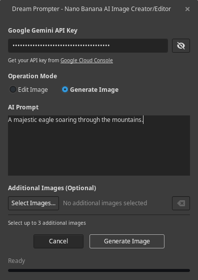

# Dream Prompter - GIMP Plugin

Dream Prompter brings powerful AI models from Replicate directly into GIMP for intelligent image generation and editing. Choose from multiple advanced models including Imagen 4, Nano Banana, Qwen Image Edit Plus, Seedream 4, and Stable Diffusion 3.5 Large Turbo.



## Features

- 🎨 **AI Image Generation**: Create new images from text descriptions
- ✨ **AI Image Editing**: Transform existing images with natural language prompts
- 🤖 **Multiple AI Models**: Choose from Imagen 4, Nano Banana, Qwen Image Edit Plus, Seedream 4, and Stable Diffusion 3.5 Large Turbo
- 🖼️ **Reference Images**: Support for multiple reference images (varies by model)
- 🔄 **Smart Layer Management**: Automatically creates properly named layers
- 🎯 **Dual Operation Modes**: Seamlessly switch between editing and generation
- 🌍 **Multi-Language Support**: Full internationalization with 10+ languages
- 🔒 **Safe File Handling**: Validates image formats and file sizes per model
- 🏗️ **Native GIMP Integration**: Works seamlessly within your GIMP workflow

## Installation

### Prerequisites

- **GIMP 3.0.x**
- **Python 3.8+**
- **Replicate API key** (paid account required)

Install the required Python library:

```bash
pip install replicate
```

### Quick Install

1. **Download the latest release** from [GitHub Releases](https://github.com/zquestz/dream-prompter/releases)

2. **Extract the release**

   This will create a folder named `dream-prompter-{version}` (e.g., `dream-prompter-1.1.3`)

3. **Move to your GIMP plugins folder with the correct name:**

   Rename and move the extracted folder to exactly `dream-prompter` in your GIMP plugins directory:
   - **Linux**: `~/.config/GIMP/3.0/plug-ins/dream-prompter/`
   - **Windows**: `%APPDATA%\GIMP\3.0\plug-ins\dream-prompter\`
   - **macOS**: `~/Library/Application Support/GIMP/3.0/plug-ins/dream-prompter/`

   Example for Linux:

   ```bash
   # Extract creates dream-prompter-1.1.3/
   unzip dream-prompter-1.1.3.zip
   # Move to correct location with correct name
   mv dream-prompter-1.1.3 ~/.config/GIMP/3.0/plug-ins/dream-prompter
   ```

4. **Make executable** (Linux/macOS only):

   ```bash
   chmod +x ~/.config/GIMP/3.0/plug-ins/dream-prompter/dream-prompter.py
   ```

5. **Restart GIMP**

**Building translations (optional):** If you need languages other than English, run `python3 scripts/build-translations.py` in the plugin directory after installation.

### Arch Linux Installation

To install Dream Prompter on Arch Linux, you can install it from the AUR.

```bash
yay -S dream-prompter
```

### Advanced Installation

#### Manual Installation from Source

1. **Find your GIMP plugins directory** (paths listed above)

2. **Create plugin directory:**

   ```bash
   mkdir -p ~/.config/GIMP/3.0/plug-ins/dream-prompter/
   ```

3. **Copy all Python files and the models directory:**

   ```bash
   cp *.py ~/.config/GIMP/3.0/plug-ins/dream-prompter/
   cp -r models ~/.config/GIMP/3.0/plug-ins/dream-prompter/
   ```

4. **Build and install translations (Optional):**

   ```bash
   python3 scripts/build-translations.py
   cp -r locale ~/.config/GIMP/3.0/plug-ins/dream-prompter/
   ```

5. **Make executable:**
   ```bash
   chmod +x ~/.config/GIMP/3.0/plug-ins/dream-prompter/dream-prompter.py
   ```

**Note:** Your final directory structure should look like:

```
~/.config/GIMP/3.0/plug-ins/dream-prompter/
├── dream-prompter.py
├── api.py
├── dialog*.py
├── integrator.py
├── settings.py
├── i18n.py
├── models/
│   ├── __init__.py
│   ├── factory.py
│   ├── imagen4.py
│   ├── nano_banana.py
│   ├── qwen_image_edit_plus.py
│   ├── seedream4.py
│   └── stable_diffusion_3_5_large_turbo.py
└── locale/ (optional)
    └── ...
```

#### Development Setup

```bash
git clone https://github.com/zquestz/dream-prompter.git
cd dream-prompter
pip install replicate
python3 scripts/build-translations.py # optional, defaults to English
ln -s $(pwd) ~/.config/GIMP/3.0/plug-ins/dream-prompter
```

### Python Dependencies Note

**Important**: Use the same Python that GIMP uses. If `pip install replicate` doesn't work:

```bash
# System-wide installation
sudo pip install replicate

# User installation (recommended)
pip install --user replicate

# Ensure Python 3
pip3 install replicate
```

#### macOS Instructions

If you get the **"replicate not installed"** error on macOS:

1. **Locate GIMP's Python** by opening the Python Console: `Filters → Development → Python-Fu`
2. **Run this command** in the console:

   ```python
   import sys; print(sys.executable)
   ```

   You should see something like:

   ```
   /Applications/GIMP.app/Contents/MacOS/python3
   ```

3. **Install replicate using GIMP's Python** from Terminal:

   ```bash
   # Change to GIMP's Python directory
   cd /Applications/GIMP.app/Contents/MacOS

   # Ensure pip is installed
   ./python3 -m ensurepip

   # Install replicate
   ./python3 -m pip install replicate
   ```

## Getting Your API Key

1. **Visit [Replicate](https://replicate.com/)**
2. **Generate an API key**
3. **Keep your key secure and monitor usage/costs**

### Available AI Models

**Imagen 4** (`google/imagen-4`) - Google's advanced image generation model:

- **Capabilities**: Generation only
- **Reference Images**: Not supported
- **File Size**: Maximum 7MB per image
- **Formats**: PNG, JPEG
- **Special Features**: Advanced safety filtering, high-quality generation

**Nano Banana** (`google/nano-banana`) - Google's Gemini 2.5 Flash Image Preview:

- **Capabilities**: Both generation and editing
- **Reference Images**: Up to 10 for generation, 9 for editing
- **File Size**: Maximum 7MB per image
- **Formats**: PNG, JPEG, WebP

**Qwen Image Edit Plus** (`qwen/qwen-image-edit-plus`) - Qwen's advanced image editing model:

- **Capabilities**: Editing only
- **Reference Images**: Up to 9 for editing
- **File Size**: Maximum 10MB per image
- **Formats**: PNG, JPEG, WebP, GIF
- **Special Features**: Specialized for image editing and transformation

**Seedream 4** (`bytedance/seedream-4`) - ByteDance's unified generation and editing model:

- **Capabilities**: Both generation and editing
- **Reference Images**: Up to 10 for generation, 9 for editing
- **File Size**: Maximum 10MB per image
- **Formats**: PNG, JPEG, WebP
- **Special Features**: 4K resolution support, unified architecture

**Stable Diffusion 3.5 Large Turbo** (`stability-ai/stable-diffusion-3.5-large-turbo`) - Stability AI's high-resolution image generation model:

- **Capabilities**: Both generation and editing
- **Reference Images**: Up to 1 for generation, none for editing
- **File Size**: Maximum 10MB per image
- **Formats**: PNG, JPEG, WebP
- **Special Features**: High-resolution generation, fast inference, fewer steps required

### Cost Considerations

- Each image generation/edit counts toward your API usage
- Monitor your usage at [Replicate](https://replicate.com/) to avoid unexpected charges

## Usage

### Basic Workflow

1. **Open an image in GIMP** (for editing) or create a new document (for generation)
2. **Launch Dream Prompter**: `Filters → AI → Dream Prompter...`
3. **Enter your API key** (saved automatically for future use)
4. **Choose your AI model**: Select from available models in the dropdown
   - **Note**: Available models will vary based on whether an image is open (edit-capable models) or not (generation-capable models)
5. **Select mode**:
   - **Edit Mode**: Transform the current layer (requires edit-capable model and open image)
   - **Generate Mode**: Create a new image (requires generation-capable model)
6. **Write your prompt**: Be descriptive and specific
7. **Add reference images** (optional): Click "Select Images..." to add references
8. **Generate**: Click the generate button and watch the progress
9. **Result**: New layer appears with a descriptive name

### Example Prompts

**For Generation:**

- "A majestic dragon flying over snow-capped mountains at sunset"
- "Portrait of a woman in Victorian dress, oil painting style"
- "Cyberpunk cityscape with neon reflections on wet streets"

**For Editing:**

- "Change the background to a peaceful forest clearing"
- "Make this person wear a red Victorian dress"
- "Transform this into a watercolor painting style"
- "Add falling snow to this winter scene"

### Tips for Best Results

- **Be specific**: "Red sports car" vs "bright red Ferrari 488 GTB"
- **Include style**: "photorealistic", "oil painting", "digital art"
- **Describe lighting**: "golden hour", "dramatic shadows", "soft natural light"
- **Use reference images** to guide style and composition
- **Keep files under 7MB** for reference images

## Language Support

### Available Languages

Dream Prompter is fully translated and available in:

- **🇺🇸 English** (default)
- **🇪🇸 Spanish** (complete)
- **🇫🇷 French** (complete)
- **🇵🇹 Portuguese** (complete)
- **🇷🇺 Russian** (complete)
- **🇯🇵 Japanese** (complete)
- **🇮🇳 Hindi** (complete)
- **🇧🇩 Bengali** (complete)
- **🇨🇳 Chinese (Simplified)** (complete)
- **🇹🇼 Chinese (Traditional)** (complete)
- **🇰🇷 Korean** (complete)

The plugin automatically detects your system language and uses the appropriate translation. If your language isn't available, it defaults to English.

### For Developers

```bash
# Extract new translatable strings
python3 scripts/update-pot.py

# Update existing translations
python3 scripts/update-translations.py

# Build compiled translations
python3 scripts/build-translations.py
```

## Architecture

The plugin is organized into focused modules with a clean model-driven architecture:

### Core Plugin Files

- **`dream-prompter.py`** - Main GIMP plugin entry point
- **`dialog_gtk.py`** - GTK user interface components
- **`dialog_events.py`** - Event handling and user interactions
- **`dialog_threads.py`** - Background processing and threading
- **`api.py`** - Replicate API integration
- **`integrator.py`** - GIMP-specific operations
- **`settings.py`** - Configuration persistence
- **`i18n.py`** - Internationalization support

### Model System

- **`models/__init__.py`** - Base model classes and registry system
- **`models/factory.py`** - Model factory for centralized model management
- **`models/imagen4.py`** - Imagen 4 model implementation
- **`models/nano_banana.py`** - Nano Banana model implementation
- **`models/qwen_image_edit_plus.py`** - Qwen Image Edit Plus model implementation
- **`models/seedream4.py`** - Seedream 4 model implementation

The model system provides a clean abstraction for AI models, making it easy to:

- **Add new models** by implementing the `BaseModel` interface
- **Validate inputs** using model-specific limits and constraints
- **Build API requests** with model-specific parameter formats
- **Maintain consistency** across the entire plugin

### Extending with New Models

To add support for a new Replicate model:

1. **Create a new model file** in the `models/` directory (e.g., `models/my_model.py`)
2. **Implement the BaseModel interface**:

```python
from . import BaseModel, OutputFormat, register_model

class MyModel(BaseModel):
    @property
    def name(self) -> str:
        return "my-account/my-model"

    @property
    def display_name(self) -> str:
        return "My Custom Model"

    # Implement other required properties...

    def build_generation_input(self, prompt, reference_images=None, **kwargs):
        # Implementation for generating...
        pass

    def build_edit_input(self, prompt, main_image, reference_images=None, **kwargs):
        # Implementation for editing...
        pass

# Register the model
my_model = MyModel()
register_model(my_model)
```

3. **Import the model** in `models/factory.py` to ensure it's loaded
4. **The model is now available** throughout the plugin with automatic validation and UI updates

The `nano_banana.py` file serves as a complete reference implementation.

## Troubleshooting

### Common Issues

**"replicate not installed" warning**

- Install with: `pip install replicate`
- Ensure you're using GIMP's Python environment

**Plugin doesn't appear in menu**

- Check file permissions: `chmod +x dream-prompter.py`
- Restart GIMP after installation
- Verify files are in correct plugins directory

**API errors**

- Verify your API key is correct
- Check your quota at [Replicate](https://replicate.com/)
- Monitor costs to avoid unexpected charges

**Interface problems**

- Check GIMP's Error Console: `Windows → Dockable Dialogs → Error Console`
- Ensure translations are built: `python3 scripts/build-translations.py`
- Report UI issues with screenshots

**Model or mode not available**

- **Edit mode disabled**: Some models (like Imagen 4) only support generation - select a different model or use Generate mode
- **Model missing from dropdown**: Models are filtered based on context - edit-only models won't appear when no image is open
- **Generate mode disabled**: Some models (like Qwen Image Edit Plus) only support editing - open an image first or select a different model

### Getting Help

1. **Check the Error Console** in GIMP for specific error messages
2. **Verify all requirements** are installed correctly
3. **Test with simple prompts** first
4. **Check file permissions** on the plugin directory
5. **Review API quotas** if getting timeout errors

## Contributing

### For Translators

We welcome translations! Here's how to contribute:

1. **Copy the template**: `cp locale/dream-prompter.pot locale/[YOUR_LANG].po`
2. **Translate the strings** using Poedit, Lokalize, or any text editor
3. **Test your translation**: Build with `python3 scripts/build-translations.py`
4. **Submit a pull request** with your `.po` file

**Translation Guidelines:**

- Keep UI text concise but clear
- Use GIMP's existing terminology for your language
- Preserve HTML tags and placeholders like `{count}`, `{url}`
- Test that text fits in the interface

### For Developers

1. **Fork the repository**
2. **Create a feature branch**
3. **Follow the existing code style**
4. **Update translations** if adding new strings
5. **Submit a pull request**

## License

This project is licensed under the MIT License - see the [LICENSE](LICENSE) file for details.

## Credits

Built with Replicate's API providing access to multiple advanced AI models including Google's Imagen 4, Google's Nano Banana, Qwen's Image Edit Plus, ByteDance's Seedream 4, and Stability AI's Stable Diffusion 3.5 Large Turbo.
